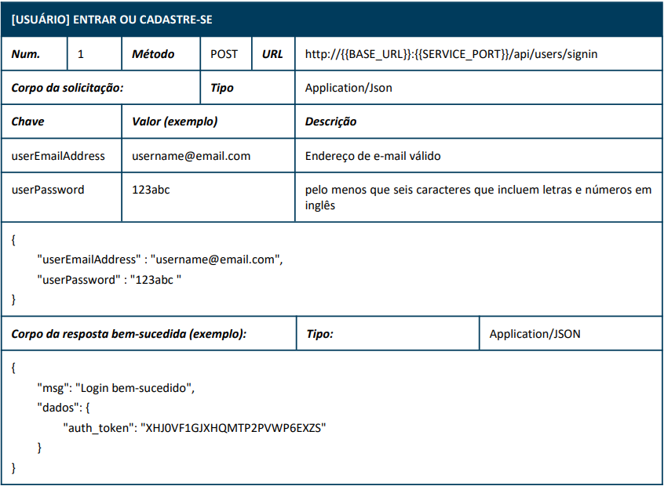
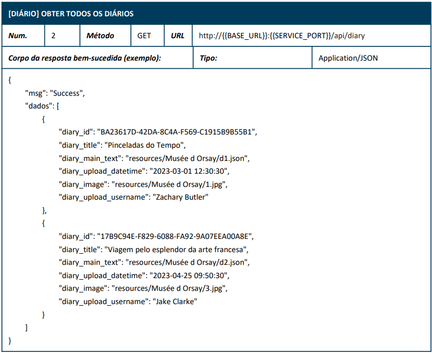
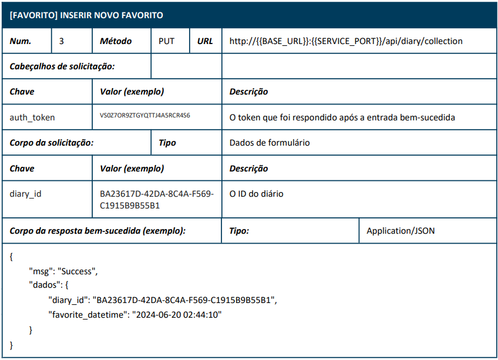
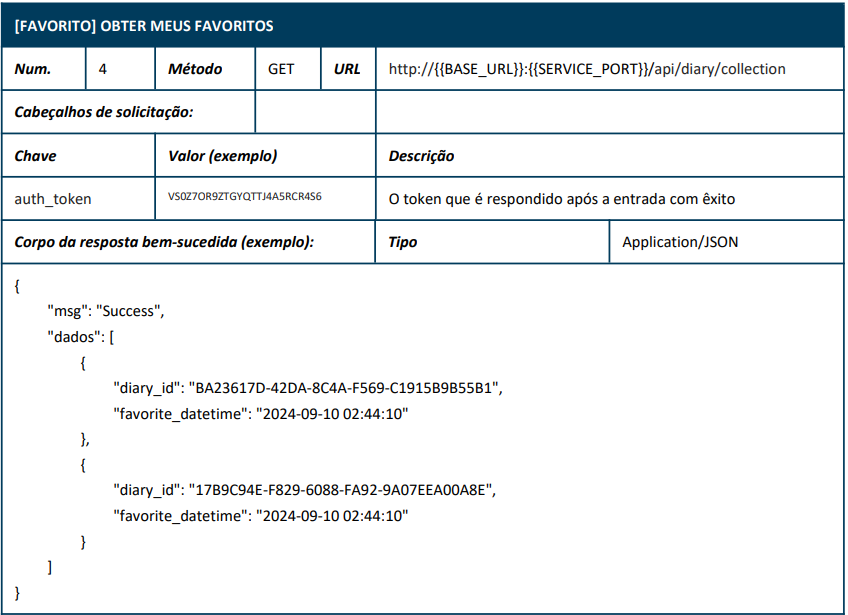
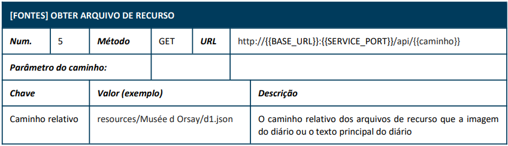
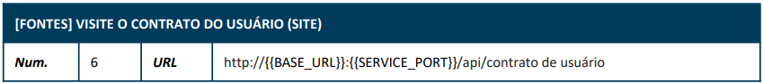

# X-French API
API para ser utilizada em prova para treinamento para worldskills modalidade programação para dispositivos moveis
## Tencologias
- Node.js
- VsCOde
- Prisma
- XAMPP (Mysql) - Versão MariaDB

## Dependências
- express
- cors
- dotenv
- swagger-ui-express
- jsonwebtoken
- uuid
- @prisma/client
- path

## Passos para executar localmente
- 1 Clone este repositório
```bash
git clone https://github.com/wellifabio/x-french-api-2025.git
```
- 2 Abra com **VsCode** e abra um terminal `CTRL + "` do tipo `CMD` ou `bash`
- 3 Instale as dependências
```bash
npm install
```
- 4 Crie o arquivo `.env` na pasta raís contendo
```env
DATABASE_URL="mysql://root@localhost:3306/x_french_2025"
JWT_SECRET=mysecret
```
- 5 Abra o **XAMPP**, clique em start em Apache e **MySQL** e no terminal do VsCode implante o banco de dados e execute o servidor
```bash
npx prisma migrate dev --name init
npm run dev
```
- 6 A resposta será semelhante a a seguir:
```bash
Server response in:
http://{{BASE_URL}}:{{SERVICE_PORT}}
http://localhost:3000/api
http://localhost:3000/swagger
```

## Documentação da API






